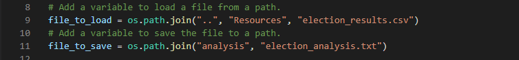
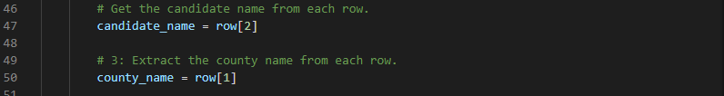

# Election_Analysis

# Project Overview
A Colorado Board of Elections employee requested an election audit of a recent local congressional election to include the following analysis:

1. Calculation of the total number of votes cast.
2. A complete list of candidates who received votes.
3. The total number of votes each candidate received.
4. The percentage of votes each candidate won.
5. A winner of the election determined based on popular vote.

Following the preliminary findings of items 1-5 above the commission requested some additional data to complete the audit, that is:
1. Voter turnout for each county.
2. The percentage votes from each county based on the total count.
3. The county with the highest voter turnout.

## Resources
The election result data is accumulated from Mail-In Ballots, Punch Cards, and Direct Recording Electronics (DRE) and stored in the file election_results.csv provided in the Resources folder.  The software used to perform required tasks included Python 3.8.5 and Visual Studio Code 1.56.0.

# Election Audit Results
The analysis of this election shows that:
- There were 369,711 total votes cast in the election.
- The candidates were:
  * Charles Casper Stockham
  * Diana DeGette
  * Raymon Anthony Doane
- The individual candidate results were:
  * Charles Casper Stockham received 23.0% of the vote and 85,213 number of votes.
  * Diana DeGette received 73.8% of the vote and 272,892 number of votes.
  * Raymon Anthony Doane received 3.1% of the vote and 11,606 number of votes.
- The winner of the election was determined to be Diana DeGette who received 73.8% of the vote and 272,892 number of votes.
- Voter turnout by county is listed below:
  * Jefferson county had 38,855 votes which represented 10.5% of the total votes cast.
  * Denver county had 306,055 votes which represented 82.8% of the total votes cast.
  * Arapahoe county had 24,801 votes which represented 6.7% of the total votes cast.
- The county with the largest voter turnout was Denver.

## Election Audit Summary
A script was written in Python to import election data, including county of registered voter and the selected candidate from several thousand ballots. This script can automate the process of auditing election results so that it could be used not only for other congressional districts but also senatorial districts and local elections.
To update the script for new election data, update the "file_to_load" path with the new CSV data file name and location, for example:

Identify the index value of the data of interest, where the first column index starts at "0."  For example in election_results.csv, the candidate names are found in the third column (index 2) and county names of the registered voters is found in the second column (index 1):

Elements of the code can be modified in this way to be used for future elections. 
